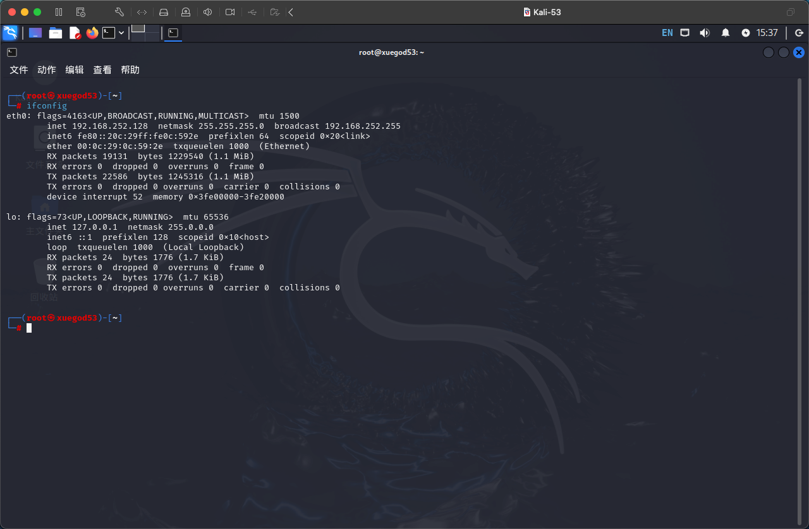

# 二、简易配置


## &#x20;一、root 账号设置

打开 terminal 之后很多操作都会直接在终端进行

<figure><figcaption><p>terminal</p></figcaption></figure>

```sh
sudo passwd root
```

<figure><figcaption></figcaption></figure>

这里会先输入 登录用户密码 然后再设置管理员的密码 和 确认密码


需要注意的是 这里的密码为密文输入


<figure><figcaption></figcaption></figure>

修改完成后 我们重新登录

<figure><figcaption></figcaption></figure>

<figure><figcaption></figcaption></figure>

<figure><figcaption></figcaption></figure>

此时我们打开 terminal 可以看到红色提示 以及命令行为 # 开头

<figure><figcaption></figcaption></figure>

## 二、系统中文修改

后续代码都直接在 root 账号操作 因此不需要带 sudo 命令

```sh
dpkg-reconfigure locales
```

进入语言选择界面，选择 zh\_CN.UTF-8 UTF-8

<figure><figcaption></figcaption></figure>

<figure><figcaption></figcaption></figure>

回车确认 重新启动 重启后在弹框中 选择更新名称即可

<figure><figcaption></figcaption></figure>

<figure><figcaption></figcaption></figure>

## 三、修改apt安装包的源为国内源

因为Kali自带的源是国外的，经常会因为网络问题，而无法安装或更新软件包。而且国外的源速度很慢。所以我们直接使用国内的源，方便快速。

```sh
vim /etc/apt/sources.list
```

<figure><figcaption></figcaption></figure>


vim 编辑器操作：\
按 i 即可切换到输入模式\
按 esc 退出编辑模式\
:wq 保存退出


```shell
#中科大Kali源
deb http://mirrors.ustc.edu.cn/kali kali-rolling main non-free contrib
deb-src http://mirrors.ustc.edu.cn/kali kali-rolling main non-free contribshell
```

<figure><figcaption></figcaption></figure>

执行命令 检查是否切换成功

```sh
apt update
```

<figure><figcaption></figcaption></figure>

## 四、中文输入法安装

```
apt-get install ibus ibus-pinyin
```

<figure><figcaption></figcaption></figure>

输入 y 确认安装

<figure><figcaption></figcaption></figure>

重新启动 kali 在右上角切换中文输入法

<figure><figcaption></figcaption></figure>

## 五、静态 ip 网络配置

在 mac 系统下，先输入命令查看自动配置的 ip

```sh
ifconfig
```

<figure><figcaption></figcaption></figure>

之后输入指令进入 vim 编辑器

```sh
vim /etc/network/interfaces
```

<figure><figcaption></figcaption></figure>

根据自己的 ip 去配置端口号即可 我这里配置的是 53 端口

```
auto eth0
iface eth0 inet static			
address 192.168.252.53			
netmask 255.255.255.0			
gateway 192.168.252.1
```

<figure><figcaption></figcaption></figure>

&#x20;esc + :wq 退出之后 要关闭网络服务 之后再重新启动

```sh
systemctl stop NetworkManager
```

<figure><figcaption></figcaption></figure>


注：关闭NetworkManager服务，该服务是网络服务的图形管理工具，该服务会自动接管networking服务，有可能造成重启networking服务时配置不生效的问题。


再次重启网络服务

```sh
systemctl restart networking
```

<figure><figcaption></figcaption></figure>


这里注意，此时我们重启网络服务后，是用 ifconfig 看到的还是我们之前的 ip，无需惊慌，此时我们只需要再次重启下网络服务，再次打印查看即可看到修改。


第一次打印的 ifconfig

<figure><figcaption></figcaption></figure>

重启之后，第二次打印的 ifconfig

<figure><figcaption></figcaption></figure>

临时配置IP地址

```sh
ifconfig eth0:1 192.168.252.54/24
```

mac 电脑快速查看本机 ip 命令

```sh
ifconfig en0 | grep "inet " | awk '{print $2}'
```


上述方法在 windows 电脑上 需要查看 windows 电脑 ip，是用 ipconfig 命令查看，然后根据对应的 ip 去配置相关的 ip 和网关等，个人目前在 mac 直接采用如下配置（默认配置，可以不做上述修改）


<figure><figcaption></figcaption></figure>

<figure><figcaption></figcaption></figure>

## 六、关闭自动锁屏

系统 - 设置 - 电源管理器

<figure><figcaption></figcaption></figure>

修改如图配置

<figure><figcaption></figcaption></figure>

## 七、生成快照

虚拟机快照管理

<figure><figcaption></figcaption></figure>

右键 拍摄快照

<figure><figcaption></figcaption></figure>

重命名快照

<figure><figcaption></figcaption></figure>

拍摄好之后可以在快照管理里查看

<figure><figcaption></figcaption></figure>
